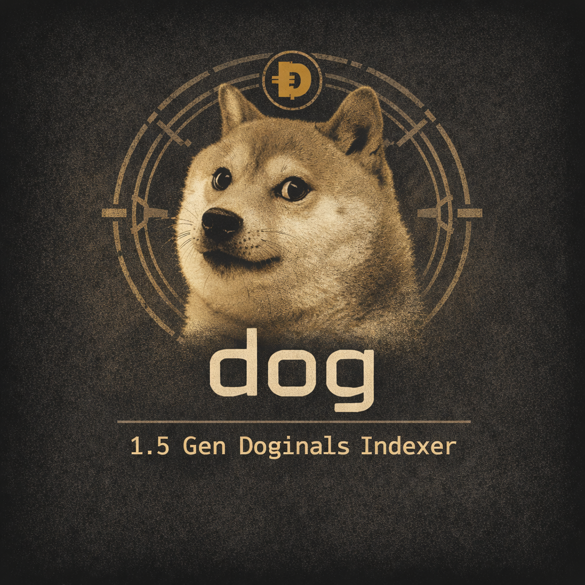

> **Note:** Dogecoin has more reorgs than Bitcoin due to its 1-minute block
> times. Periodically back up your redb index so you can restore from a
> checkpoint. See [reindexing](docs/src/guides/reindexing.md).

<p align="center">
  
</p>

# dog — 1.5 Gen Doginals Indexer for Dogecoin

**Maintained & modernized by Jon Heaven (@jontype)**

Built on the foundational work of **Casey Rodarmor** (Bitcoin Ordinals), **apezord** (ord-dogecoin), and **Doge Labs / Wonky Ord** (same core team behind the wonky-ord indexer) — the true pioneers who brought Ordinals to Dogecoin in 1st gen.

This is the actively maintained, up-to-date fork that keeps Doginals indexing alive in 2026:
- Latest Bitcoin ord base + apezord/wonky changes
- Modern upgrades, bug fixes, and new protocol support
- The bridge between 1st-gen and the 2nd-gen production backend (kabosu)

**Often imitated. Never duplicated.**

Part of the leading open-source stack for Doginals on Dogecoin:
Indexer • Wallet SDK • Marketplace Protocol • Launchpad Tools

<h1 align=center><code>dog</code> — Official Doginals Indexer & Explorer</h1>

<div align=center>
  <a href=https://github.com/jonheaven/dog/blob/master/docs/src/doginals-spec.md>
    
  </a>
  <a href=https://github.com/jonheaven/dog/actions>
    
  </a>
  <a href=https://discord.gg/doginals>
    
  </a>
</div>
<br>

---

## History & Credits

**Dogecoin Doginals** started in early 2023 thanks to the pioneers who built the foundation:

- **apezord** (@apezord) — The O.G. who introduced Doginals to the world. He created the original `ord-dogecoin` port (https://github.com/apezord/ord-dogecoin) and the inscription protocol that brought Ordinals theory to Dogecoin for the first time.
- **Doge Labs** (verydogelabs / Wonky Ord team) — They forked and advanced the tech with `wonky-ord-dogecoin`, ran the main public indexer/explorer for years, pushed DRC-20, and helped power the ecosystem.
- The whole early community that kept the dream alive.

When Doge Labs stepped away, their repositories were taken down and the ecosystem went quiet for a long stretch.

Beginning in mid-2025, I (**Jon Heaven** — **@jontype** / jonheaven) picked up the torch. I had already been developing advancements on this indexer in another project when I forked the original work, performed a full modern port + heavy rewrite of the Bitcoin `ord` codebase, and turned it into a fast, clean, actively maintained Dogecoin-native platform with major upgrades: direct `.blk` sync, selective indexing, Dogemaps, Koinu Relics, improved DRC-20 tooling, Dogecoin Name System, and more.

**This repository (jonheaven/dog) is now the canonical, actively developed home of Dogecoin Doginals.**

I’m here because I genuinely care about open-source development on Dogecoin. The code is released under **CC0-1.0** so anyone can freely use, fork, run, or build on it. The full chain of contributors is preserved in the git history and this README.

Huge respect and thanks to apezord, Doge Labs, and every builder who came before. The fire they started is still burning — and I’m committed to keeping it growing.

Big shout-out to the community member who already dropped a bug fix — that’s the spirit! ❤️

— Jon Heaven (@jontype)  
March 2026

**Dogecoin Doginals indexer, block explorer, and CLI wallet.**

Doginals imbue every **koinu** with numismatic value, making them collectable
and tradeable as on-chain digital artifacts.

**[📖 Doginals Protocol v1 Spec →](docs/src/doginals-spec.md)** · koinu math, envelope format & implementers checklist

It is experimental software with no warranty. See [LICENSE](LICENSE) for details.

---

## Features

### Core indexing

| Command | Description |
|---------|-------------|
| `dog index update` | Index the chain (inscriptions, Dunes, koinu ranges) |
| `dog server` | Run the block explorer web UI |

### Dogecoin-specific

| Command | Description |
|---------|-------------|
| `dog scan` | **Scan a block range for inscriptions — no prior indexing needed** |
| `dog dns resolve <name>` | Resolve a Dogecoin Name System (.doge) name |
| `dog dns list` | List all registered DNS names |
| `dog dns config <name>` | Show DNS configuration for a name |
| `dog drc20 tokens` | List all deployed DRC-20 tokens |
| `dog drc20 token <tick>` | Show info for a single DRC-20 token |
| `dog drc20 balance <address>` | Show DRC-20 balances for an address |
| `dog inscribe --dogemap <block>` | **Claim a Dogemap block title** (e.g. `--dogemap 5056597`) |
| `dog dogemap status <block>` | Check who owns a block number |
| `dog dogemap list` | List all claimed Dogemap block titles |

### Dogemaps — Claim Dogecoin Block Titles

Permanent ownership of any Dogecoin block via inscription (Bitcoin Bitmaps analog).
First to inscribe `{block}.dogemap` as `text/plain` owns that block forever.

```
# Claim block 5056597
dog inscribe --dogemap 5056597

# Check ownership
dog dogemap status 5056597

# Explorer API (returns JSON + procedural orange SVG)
curl http://localhost:80/dogemap/5056597
```

The `/dogemap/{block}` API endpoint returns a procedural SVG generated from real
block data (hash → color seed, tx count → pattern) — ready to drop into a website
or 3D metaverse renderer.

Full protocol spec: [docs/src/doginals-spec.md — Dogemaps v1](docs/src/doginals-spec.md#dogemaps-block-titles-v1)

### Selective Indexing

Customize what gets processed for faster or lighter runs.

```bash
# Only index Dogemap claims — skip images, DRC-20, DNS entirely
dog index update --only dogemap

# Only tokens + names (no Dogemaps)
dog index update --only drc20,dns

# Ultra-light: Dogemaps only, no inscription content stored
dog index update --only dogemap --no-index-inscriptions

# Track every individual koinu (replaces old --index-sats)
dog --index-koinu index update

# Full Dune token indexing + address lookup
dog --index-dunes --index-addresses index update
```

| Flag | Env var | Effect |
|------|---------|--------|
| `--only dns,drc20,dogemap` | `ORD_ONLY_PROTOCOLS` | Process only the listed sub-protocols (default: all three) |
| `--index-koinu` | `ORD_INDEX_KOINU` | Track every koinu by ordinal number. Required for `dog find`, `dog list`, koinu card. |
| `--index-dunes` | `ORD_INDEX_DUNES` | Index Dune etchings, mints, transfers. Required for `dog dune *`. |
| `--index-addresses` | `ORD_INDEX_ADDRESSES` | Address→UTXOs index. Required for `dog dune balance`. |
| `--no-index-inscriptions` | `ORD_NO_INDEX_INSCRIPTIONS` | Skip inscription content (useful for Dune/Dogemap-only nodes). |

Full reference: [docs/src/dogecoin.md — Selective indexing flags](docs/src/dogecoin.md#6-selective-indexing-flags)

### Fast sync (direct .blk file reads)

`dog` reads blocks directly from Dogecoin Core's binary `.blk` files,
bypassing JSON-RPC entirely — typically **5–20× faster** for initial indexing.

```
# Build a shadow copy of Core's block index (safe while Core is running)
dog --dogecoin-data-dir F:\DogecoinData index refresh-blk-index

# Then index at full disk speed (stop Core first for maximum speed)
dog --dogecoin-data-dir F:\DogecoinData index update
```

The shadow copy lives at `<dog-data-dir>/blk-index/` and is refreshed
automatically on every `dog index update` run.

---

## Quick Start

### 1. Configure your data directory

Copy `.env.example` to `.env` and set `DOGECOIN_DATA_DIR`:

```
DOGECOIN_DATA_DIR=F:\DogecoinData   # wherever your Core data lives
```

Or pass it on every command:

```
dog --dogecoin-data-dir F:\DogecoinData index update
```

### 2. (Optional) Build the block index shadow copy

```
dog index refresh-blk-index
```

This copies Core's LevelDB block index to dog's data dir so fast `.blk`
file reads work even while Core is running.

### 3. Index the chain

```
dog index update
```

### 4. Run the explorer

```
dog server
```

Open http://localhost:80 — you now have your own Doginals explorer.

---

## `dog scan` — inspect inscriptions without a full index

Scan any block range for inscriptions right now, with no prior indexing:

```
# Find all inscriptions between two heights
dog scan --from 4609000 --to 4620000

# Verify a specific inscription exists
dog scan --from 4609000 --to 4700000 \
  --txid bdfeeeacab95d0a230e1124f0635ac9a47925fef4bb1d41a0a0c6e8d8232af7a

# Export all inscriptions owned by your address to disk
dog scan --from 4609000 --to 5000000 \
  --address DHrqn6H6ocgbRB1Szu7Q1sn1tVTfkpinnc \
  --out ./my-inscriptions

# JSON output
dog scan --from 4609000 --to 4620000 --json
```

With `--out`, each inscription is saved as:
```
<out>/
  <height>_<txid>i<n>/
    content.<ext>   ← the actual image / text / audio
    info.json       ← height, txid, content_type, recipient, size
```

See [docs/src/scanning.md](docs/src/scanning.md) for full details.

---

## DRC-20 tokens

```
dog drc20 tokens                             # list all tokens
dog drc20 token dogi                         # info for $DOGI
dog drc20 balance DHrqn6H6ocgbRB1Szu7Q1sn1tVTfkpinnc          # all balances
dog drc20 balance DHrqn6H6ocgbRB1Szu7Q1sn1tVTfkpinnc --tick dogi  # single token
dog drc20 balance DHrqn6H6ocgbRB1Szu7Q1sn1tVTfkpinnc --json
```

See [docs/src/drc20.md](docs/src/drc20.md) for details.

---

## Dogecoin Name System (DNS)

`.doge` and other Dogecoin namespaces, resolved from Doginal inscriptions:

```
dog dns resolve satoshi.doge
dog dns resolve jon.doge
dog dns list --namespace doge
dog dns list --namespace doge --json
dog dns config satoshi.doge
```

See [docs/src/dns.md](docs/src/dns.md) for details.

---

## Doginals Inscription Protocol (v1)

Doginals use a **legacy scriptSig envelope** — no Taproot, no SegWit, no
witness data. Dogecoin has neither as of 2026, so this is the only valid
on-chain inscription format.

Full specification: **[docs/src/doginals-spec.md](docs/src/doginals-spec.md)**

### Envelope layout

An inscription lives in the `scriptSig` of `input[0]` of the commit
transaction as a sequence of data-push operations:

```
PUSH("ord")              ← 3-byte protocol marker (ASCII "ord", hex 6f7264)
PUSH(<tag>)              ← field tag (see table below)
PUSH(<value>)            ← field value
... (repeat tag/value pairs)
PUSH("")                 ← empty push at a tag position = body separator
PUSH(<body_chunk>)       ← content bytes (repeat for large payloads)
```

#### Field tags

| Tag (hex) | Field              | Notes                                        |
|-----------|--------------------|----------------------------------------------|
| `01`      | `content_type`     | MIME string, e.g. `text/plain;charset=utf-8` |
| `02`      | `pointer`          | koinu-offset redirect                        |
| `03`      | `parent`           | parent inscription ID                        |
| `05`      | `metadata`         | CBOR metadata blob                           |
| `07`      | `metaprotocol`     | sub-protocol identifier (e.g. `drc-20`)      |
| `09`      | `content_encoding` | `br`, `gzip`, etc.                           |
| `0b`      | `delegate`         | delegation target inscription ID             |
| `00`      | *(body separator)* | empty push at an even (tag) position         |

Even-numbered tags are consensus-critical; unknown odd tags are tolerated
(same rule as Bitcoin Ordinals).

### Minimal example — a text inscription

```
scriptSig pushes:
  "ord"                        ← protocol marker
  \x01                         ← tag: content_type
  "text/plain;charset=utf-8"   ← value
  ""                           ← body separator (empty tag push)
  "Hello, Dogecoin!"           ← body
```

### Multi-part inscriptions

Content too large for a single transaction is split across multiple
transactions. The push immediately after `"ord"` is the piece count (a
push integer). `dog` reassembles parts by scanning for the matching
continuation transactions within the same block range.

### DRC-20

DRC-20 tokens set `metaprotocol = "drc-20"` and use a JSON body:

```json
{ "p": "drc-20", "op": "deploy",   "tick": "dogi", "max": "21000000", "lim": "1000" }
{ "p": "drc-20", "op": "mint",     "tick": "dogi", "amt": "1000" }
{ "p": "drc-20", "op": "transfer", "tick": "dogi", "amt": "500" }
```

### Parser source

[`src/inscriptions/envelope.rs`](src/inscriptions/envelope.rs) —
`RawEnvelope::from_transactions_dogecoin()`

---

## Installation

### Build from source

Linux dependencies:

```
sudo apt-get install pkg-config libssl-dev build-essential   # Debian/Ubuntu
yum install -y pkgconfig openssl-devel && yum groupinstall "Development Tools"  # RHEL
```

Rust (if not installed):

```
curl --proto '=https' --tlsv1.2 -sSf https://sh.rustup.rs | sh
```

Clone and build:

```
git clone https://github.com/jonheaven/dog.git
cd dog
cargo build --release
# binary: ./target/release/dog
```

`dog` requires rustc ≥ 1.89.0. Run `rustc --version` to check; `rustup update`
to upgrade.

---

## Connecting to Dogecoin Core

`dog` communicates with Dogecoin Core via RPC. By default it finds Core
automatically by reading the `.cookie` file from the Core data directory.

### Custom data directory

```
dog --dogecoin-data-dir /path/to/dogecoin/data index update
```

Or set `DOGECOIN_DATA_DIR` in your environment / `.env` file.

### RPC authentication

Cookie file (default, auto-detected):
```
dog --cookie-file /path/to/.cookie server
```

Username/password:
```
dog --dogecoin-rpc-username foo --dogecoin-rpc-password bar server
```

Environment variables:
```
export DOGECOIN_RPC_USERNAME=foo
export DOGECOIN_RPC_PASSWORD=bar
dog server
```

### Default ports

| Network | Port |
|---------|------|
| Dogecoin mainnet | 22555 |
| Dogecoin testnet | 44555 |
| Dogecoin regtest | 18444 |

---

## Wallet

`dog` relies on Dogecoin Core for key management and signing:

- Dogecoin Core is **not** inscription-aware — do not use `dogecoin-cli`
  commands on wallets that hold inscriptions.
- `dog wallet` commands load the wallet named `dog` by default.
- Keep inscription wallets and spending wallets separate.

---

## Security

`dog server` hosts untrusted HTML and JavaScript, creating potential XSS and
spoofing vulnerabilities. You are solely responsible for mitigation. See
[docs/src/security.md](docs/src/security.md) for details.

---

## Logging

```
RUST_LOG=info dog index update        # info-level logs
RUST_LOG=debug RUST_BACKTRACE=1 dog server   # full debug + backtrace
```

---

## Donate

`dog` is maintained by [jonheaven](https://github.com/jonheaven) ([@jontype](https://x.com/jontype)) — one year of
free open-source development for the Dogecoin/Doginals ecosystem. If this tool
has been useful to you, tips are greatly appreciated!

DOGE: `DHrqn6H6ocgbRB1Szu7Q1sn1tVTfkpinnc`

---

*Made with ❤️ for the Dogecoin community.*
